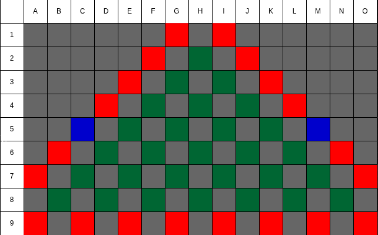
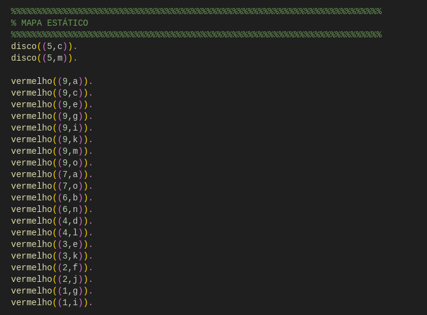
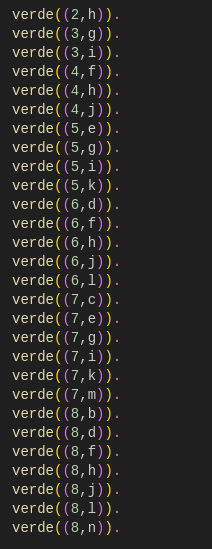

# AGENTE Q\*BERT

**GRUPO:**

*   Gabrielly Maria da Silva Barbosa 
*   José Mateus Freitas Queiroz 
*   Isabela de Paula Castro 
*   João Manoel Ribeiro Machado 
*   Giovanna Rabello Luciano 

---

## 1. RESUMO DO PROJETO

O jogo Q*BERT é um clássico arcade em que o jogador controla o personagem-título — uma pequena criatura laranja e esférica com um focinho alongado. O objetivo é ligar todos os blocos da pirâmide, eliminar os inimigos e completar a fase em no máximo 50 movimentos.

A pirâmide é formada por 28 blocos, dispostos de forma triangular. Q*BERT começa no topo e pode se mover apenas para as quatro diagonais adjacentes (superior esquerda, superior direita, inferior esquerda e inferior direita).

No início da fase, todos os blocos estão desligados (0). Sempre que Q*BERT pisa em um bloco, ele liga esse bloco (1). Quando um disco é usado, ele se torna vermelho, indicando que já foi ativado.

O jogo apresenta uma variedade de inimigos com comportamentos distintos:
*   **Teju** – A Losango roxo que podem impedir que Q*BERT chegue ao disco. Pode cair em qualquer espaço do tabuleiro, menos na linha 3.
*   **Piolho** – Estrela amarela são letais para Q*BERT. Podem cair em todo o cenário, menos na linha 8.

### DISCOS LATERAIS

Nos lados esquerdo e direito da pirâmide existem discos flutuantes multicoloridos. Quando Q*BERT salta em um disco, ele é transportado de volta ao topo da pirâmide.

Ao pegar o disco do lado esquerdo, Q*BERT ganha o poder de eliminar inimigos, e o disco não pode ser reutilizado. Além disso, o disco inverte o comportamento dos blocos: ao pisar em um bloco ligado (1), Q*BERT o desliga (0), e ao pisar em um bloco desligado (0), ele o liga (1).

### PONTUAÇÃO E RECOMPENSAS

O sistema de pontuação recompensa tanto ações básicas quanto estratégicas:

*   \+25 pontos por mudar a cor de um cubo.
*   \+500 pontos por derrotar Teju com o uso de um disco.
*   \+1 pontos por cada movimento válido realizado por Q\*BERT.
*   **Bônus de fase:** começa em 1.000 pontos na primeira tela do Nível 1 e aumenta 250 pontos por cada conclusão subsequente.

---

## 2. PEAS DO CENÁRIO

    

### P (Performance Measure) – Medida de Desempenho

O desempenho do agente Q\*BERT é avaliado conforme os seguintes critérios:

*   \+25 pontos por mudar a cor (ligar) de um bloco.
*   \+1 ponto por cada movimento válido.
*   \+500 pontos por derrotar Teju (ou outro inimigo) após adquirir o poder com o disco.
*   Bônus de fase: começa em 1000 pontos, aumentando 250 pontos por cada conclusão subsequente.
*   **Penalizações:**
    *   Morte do personagem (em blocos de perigo) = perda da fase.
    *   Falha em completar o objetivo em até 50 movimentos = derrota.
*   **Objetivo final:**
    *   Ligar todos os blocos (estado 1).
    *   Eliminar todos os inimigos.
    *   Fazer isso dentro do limite de 50 movimentos.

### E (Environment) – Ambiente

*   **Tipo:** Ambiente parcialmente observável, dinâmico e estocástico (há aleatoriedade nos inimigos).
*   **Cenário:** Grade 9x15 composta por 50 estados possíveis.
*   **Características dos blocos:**
    *   **Verdes:** acessíveis a Q\*BERT e inimigos.
    *   **Azuis:** discos especiais acessíveis apenas a Q\*Bert — ao pisar, ele é teletransportado para `(2,H)`.
    *   **Vermelhos:** blocos perigosos — causam a morte do personagem.
    *   **Cinzas:** blocos inacessíveis a todos.
*   **Estados especiais:**
    *   **(2,H):** posição inicial do agente Q\*BERT
    *   **(5,C)** e **(5,M):** discos que concedem poderes.
    *   Demais blocos podem estar ligados (1) ou desligados (0).
*   **Inimigos:**

    
    

    *   Piolho (estrela) e Teju (losango roxo) descem diagonalmente, escolhendo aleatoriamente onde parar no cenário.
    *   Inimigos não podem acessar blocos azuis ou cinzas.
*   **Regra do disco:**
    *   Após usar um disco, Q\*BERT retorna ao topo `(2,H)`.
    *   O disco torna-se vermelho (inutilizável).
    *   O poder do disco permite matar inimigos e inverter o comportamento dos blocos (pisar liga ↔ desliga).

### A (Actuators) – Atuadores

O agente Q\*BERT pode executar as seguintes ações:

*   Mover-se diagonalmente em qualquer uma das quatro direções possíveis:
    *   superior esquerda, superior direita, inferior esquerda, inferior direita.
*   Ativar blocos (pisar em blocos e alterar seu estado 0→1 ou 1→0 após obter o disco).
*   Usar discos azuis para ser teleportado ao topo `(2,H)`.
*   Eliminar inimigos (após adquirir o poder do disco).
*   Esperar (em caso de pausa após eliminar inimigos, se houver).

### S (Sensors) – Sensores

O agente Q\*BERT pode perceber:

*   Sua posição atual (linha e coluna) no tabuleiro.
*   Estado do bloco atual (ligado ou desligado).
*   Presença de inimigos em blocos adjacentes.
*   Presença e localização dos discos `(5,C)` e `(5,M)`.
*   Blocos inacessíveis (cinzas) e blocos de perigo (vermelhos).
*   Quantidade de movimentos restantes (máximo de 50).
*   Pontuação atual.

---

## 3. PEAS DO AGENTE

### P (Performance Measure) – Medida de Desempenho

**Objetivo final:**

*   Todos os blocos verdes = 1 (ligados).
*   Todos os inimigos eliminados.
*   Concluir em ≤ 50 movimentos.
*   **Pontuação:**
    *   \+1 por mover para um bloco válido.
    *   \+5 ao ligar um bloco 0→1.
    *   \+20 por matar inimigo (Teju ou Piolho) quando com poder.
    *   \+10 por usar disco válido (teleporte).
    *   Episódio termina com vitória quando (blocos=1 AND inimigos=0) antes ou no 50º movimento.

### E (Environment) – Ambiente

**Layout e tipos de célula:**

*   **Verde:** bloco acessível (por todos);
    *   `(2,H)` é acessível apenas a Q\*BERT e é a posição inicial.
*   **Cinza:** inacessível para todos (parede/vazio).
*   **Azul:** discos em `(5,C)` e `(5,M)` (acessíveis só por Q\*BERT); após uso viram vermelho (inativo).
*   **Vermelho:** bordas/poços; entrar em qualquer um dos estados mortais abaixo causa morte imediata.
*   **Estados mortais (entrar = morte):**
    *   `(1,G) (1,I), (2,F) (2,J), (3,E) (3,K), (4,D) (4,L), (6,B) (6,N), (7,A) (7,O), (9,A) (9,C), (9,E) (9,G), (9,I) (9,K), (9,M) (9,O).`.

**REGRAS GLOBAIS:**

*   Q\*BERT se move apenas nas diagonais:
    *   superior direita, superior esquerda, inferior direita e inferior esquerda entre vizinhos válidos.
*   Inimigos (Piolho e Teju) descem diagonalmente, escolhendo aleatoriamente onde parar no cenário.
*   Teleporte: ao pular num disco azul ⇒ Q\*BERT vai para `(2,H)`. O disco usado torna-se vermelho (inativo).
*   Blocos começam desligados (0).

**ESTADOS DO AGENTE:**

*   **MODO\_NORMAL** (início): sem poder; ao pisar num verde: 0→1 (liga).
*   **MODO\_PODER** (após pegar um disco): teleporta para `(2,H)`; ganha habilidade de matar inimigos por contato, comportamento de cor inverte (pisar troca: 1→0, 0→1).
*   **MODO\_FINALIZAÇÃO** (após matar todos os inimigos e pegar o outro disco): teleporta para `(2,H)` e volta a inverter os blocos.

### A (Actuators) – Atuadores

*   Uso de disco é implícito: saltar para `(5,C)` ou `(5,M)` executa o teleporte e troca de modo conforme as regras.
*   Q\*BERT se move apenas nas diagonais: superior direita, superior esquerda, inferior direita e inferior esquerda entre vizinhos válidos.

### S (Sensors) – Sensores

**Percepção total do estado:**

*   Posição de Q\*BERT (início em `(2,H)`).
*   Modo atual: `NORMAL` | `PODER` | `FINALIZAÇÃO`.
*   Contador de movimentos restantes (de 50 até 0).
*   Mapa com tipo de cada célula (verde/cinza/azul/vermelho) e estado de cor dos verdes (0/1).
*   Estado dos discos: ativos (azul) ou já usados (vermelho).
*   Posições e tipos dos inimigos, inclusive se Coily está a ≤ 2 movimentos (para efeito de morte ao usar disco).

---

## 4. REGRAS

# ESTRUTURA DE ESTADOS:

*   **PosQBert:** posição do agente `(2,H)`.
*   **Modo:** normal | poder | finalizado.
*   **Blocos:** lista com o estado de cada bloco verde (ligado=1 / desligado=0).
*   **DiscoC (DC) , DiscoM (DM):** ativo/usado.
*   **MovimentosRestantes:** número de passos (até 50).

# Fatos Iniciais:

*   Posição inicial e posições especiais.
    *   **(2,H):** Posição inicial.
    *   **normal:** modo padrão (sem poder).
    *   **todos\_desligados:** todos os blocos verdes estão em 0.
    *   **ativo, ativo:** os discos C e M ainda podem ser usados.
    *   **50:** número de movimentos disponíveis.
*   `disco((5,C))` E `disco((5,M)):` posições dos discos que teletransportam.
*   `vermelho((x,y)):` são posições indisponíveis para jogar.
*   `verde((x,y)):` são posições disponíveis para jogar.

Esses dados são a base fixa do ambiente.

(O verde precisa ser feito para todas as posições possíveis).

# AÇÕES POSSÍVEIS:

São os movimentos que o agente pode realizar.

*   **Cabeça:**
    *   `acao(mover_sup_esq, EstadoAntes, EstadoDepois)`
    *   “Existe uma ação chamada `mover_sup_esq` que transforma o `EstadoAntes` no `EstadoDepois`."
*   **Corpo (parte depois de `:-`):**
    *   `pos_destino((L,C), (L1,C1), diagonal_sup_esq): ` verifica se (L1,C1) realmente é a diagonal superior esquerda da posição (L,C).
    *   `(verde((L1,C1)) -> atualiza_blocos(Modo,(L1,C1),Blocos,Blocos1) ; ;  Blocos1 = Blocos):` Se o destino for um bloco verde (válido e seguro), atualiza o estado dos blocos. Caso contrário, mantém os blocos inalterados.
    *   `dbg('acao(mover_sup_esq): ~w,~w -> ~w,~w  M:~w->~w~n',[L,C,L1,C1,M,M1]):` mostra posição inicial, final e número de movimentos restantes.
    *   `M1 is M - 1:` consome 1 movimento.

*   **O QUE ACONTECE EM EXECUÇÃO:**
    *   Quando o prolog tenta provar uma jogada (`acao(mover_sup_esq, E1, E2)`), ele:
1. Determina o destino (L1,C1) que é diagonal superior esquerda de (L,C).
2. Verifica se o destino é verde — se for, atualiza o tabuleiro com o novo estado do bloco.
3. Reduz o contador de movimentos (M1 = M - 1).
4. Cria o novo estado E2 (posição, blocos atualizados e movimentos restantes)
5. Retorna E2, permitindo que o agente continue sua sequência de ações.

É assim que o Prolog “gera” os próximos estados possíveis do jogo:

---
# REGRA DO DISCO (TELEPORTE E MODO DE PODER):

Define o que acontece quando Q\*BERT pisa num disco:

*   Se ele estiver em `(5,C)` e o disco estiver ativo, ele:
    *   é **teletransportado** para o topo `(2,H)`.
    *   muda o modo para `poder` (agora ele pode matar inimigos).
    *   o disco `(5,C)` passa a estar `usado`.

O ponto e vírgula (`;`) significa **“ou”**, então vale para `(5,C)` ou `(5,M)`.

*   **Cabeça:**
    *   `acao(mover_sup_, EstadoAntes, EstadoDepois)`
    *   “Existe uma ação chamada usardisco que transforma o estado atual (EstadoAntes) no estado resultante (EstadoDepois)."
*   **Corpo ( pós `:-`):**
    *   `((L,C) = (5,C), DC = ativo, DC1 = usado, DM1 = DM:` Se o agente está na posição (5,C) e o disco de cor (DC) está ativo, ele é usado. O disco de matar (DM) permanece no mesmo estado.
    *   `((L,C) = (5,M), DM = ativo, DM1 = usado, DC1 = DC):` Se o agente está na posição (5,M) e o disco de matar (DM) está ativo, ele é usado (vira “usado”). O disco de cor (DC) permanece no mesmo estado.
    *   `(Modo = normal -> Modo1 = poder ; Modo1 = normal ):` O modo alterna entre normal e poder, dependendo do estado atual.
    *   `dbg('acao(usardisco_esq/disco C): 5,c -> 5,c  M:~w->~w', [M,M1]):` Mostra no console a ação realizada e a variação no número de movimentos.
    *   `M1 is M - 1:`reduz o número de movimentos.

*   **O QUE ACONTECE EM EXECUÇÃO:**
    *   Quando o Prolog tenta provar uma jogada acao(usardisco,E1,E2), ele:
1. Verifica a posição atual (L,C) do agente.
2. Se estiver em (5,C) com DC ativo, usa o disco de cor.
3. Se estiver em (5,M) com DM ativo, usa o disco de matar.
4. Atualiza o modo para poder e mantém os blocos.
5. Reduz o contador de movimentos: M1 = M - 1.
6. Define o novo estado E2.

---
# MODO PODER E BLOCOS:
Essa regra atualiza o estado do jogo, removendo o bloco clicável da posição atual quando o agente está em modo poder.

*   **Cabeça:**
    *   `acao(remover_blocos_poder, estado((L,C), poder, Blocos, DC, DM, M), estado((L,C), poder, Blocos1, DC, DM, M1)).`
*   **Corpo ( pós `:-`):**
    *   `member((L,C), Blocos):` verifica se a posição atual (L,C) está na lista de blocos clicados.
    *  `delete(Blocos, (L,C), Blocos1):` se estiver, remove o bloco da lista. Caso não esteja, mantém os blocos inalterados (Blocos1 = Blocos).
    *   `M1 is M - 1:`reduz o número de movimentos.

*   **O QUE ACONTECE EM EXECUÇÃO:**
    *   Quando o agente Q*BERT chega num bloco enquanto está com poder ativo, o jogo:
1. Verifica se o bloco está na lista de blocos clicados.
2. Se estiver, remove da lista — o bloco deixa de ser clicável.
3. Mantém o modo poder ativo.
4. Diminui 1 movimento restante.

---
# MODO PODER E INIMIGOS:

A ação matar_inimigo define o comportamento quando o agente está em modo poder e encosta em um inimigo — o inimigo é removido.

*   **Cabeça:**
    *   `acao(matar_inimigo,estado((L,C), poder, Blocos, DC, DM, M),estado((L,C), poder, Blocos, DC, DM, M1)).`
*   **Corpo ( pós `:-`):**
    * `inimigo((L,C)):` verifica se há um inimigo na posição do agente.
    * `remover_inimigo((L,C)):` se houver, remove o inimigo da lista de inimigos ativos.
    * `M1 is M - 1:` reduz o número de movimentos.

*   **O QUE ACONTECE EM EXECUÇÃO:**
1. O Q*BERT se move até uma posição. Se estiver em modo poder e houver um inimigo nessa posição: O inimigo é removido do cenário.
2. O agente continua em modo poder.
3. Um movimento é consumido (M1 = M - 1).

---
# COLISÃO COM INIMIGOS:
A ação colisao_inimigo define o que acontece quando o Q*BERT encosta em um inimigo sem estar em modo poder.

*   **Cabeça:**
    * `acao(colisao_inimigo,estado((L,C), Modo, Blocos, DC, DM, M),estado(morte, Modo, Blocos, DC, DM, M)):` A ação colisao_inimigo define o que acontece quando o Q*bert encosta em um inimigo sem estar em modo poder

*   **Corpo ( pós `:-`):**
    * `inimigo((L,C)):` verifica se existe um inimigo na posição atual do agente.
    * Se sim, o agente entra no estado de morte — indicando o fim da partida ou perda de vida.
    * `M1 is M - 1:` reduz o número de movimentos.

*   **O QUE ACONTECE EM EXECUÇÃO:**
1. Verifica se a posição (L,C) contém um inimigo.
2. Se sim, o estado resultante passa a ser morte.
3. Caso contrário, a ação falha (ou outra ação é avaliada).

---
# CONDIÇÃO DE DERROTA:
A ação perde define as condições em que o agente é derrotado — seja por cair em um bloco vermelho ou por colidir com um inimigo na mesma posição.

*   **Cabeça:**
    * `acao(perde, estado((L,C),Modo,Blocos,DC,DM,M), estado(morte,Modo,Blocos,DC,DM,M))`.
*   **Corpo ( pós `:-`):**
    * `vermelho((L,C)):` Se a posição (L,C) for um bloco vermelho, o agente perde.
    * `inimigo((L,C)):` Se houver um inimigo na posição (L,C), o agente também perde.
    * `dbg('[perde] caiu em ~w-~w~n', [L,C]):` Após detectar a perda, imprime uma mensagem de depuração indicando a posição em que ocorreu.

*   **O QUE ACONTECE EM EXECUÇÃO:**
1. Ele verifica se a posição atual (L,C) é vermelha ou se existe um inimigo nessa mesma posição.
2. Caso qualquer uma dessas condições seja verdadeira, o estado resultante é alterado para morte, representando o fim da partida ou a perda de uma vida.
3. Se nenhuma condição for satisfeita, a ação falha (isto é, o agente não perde).

---
# CONDIÇÃO DE VITÓRIA:

Essa é a regra do fim do jogo com vitória:

*   Ela é verdadeira quando:

    *   `todos_ligados:` coleta todas as posições verdes via verde(lista), ordena e compara com os blocos atualmente ligados (Blocos). Vence se os conjuntos forem iguais.
    *   `M >= 0:` ainda restam movimentos (ou exatamente zero), então a vitória é válida.

---
# REGRA RECURSIVA (JOGABILIDADE COMPLETA):

Essas três regras fazem o motor do jogo lógico, igual o exemplo do “macaco e a banana” apresentados na aula de inteligência artificial ministrada pelo professor **Murilo Coelho Naldi.**

*   **Cabeça:**
    * `consegue(EstadoFinal):` Tenta encontrar algum EstadoFinal vencedor partindo do estado inicial definido por inicio/1.

*   **Corpo ( pós `:-`):**
    * `inicio(EstadoInicial):` Obtém EstadoInicial com inicio/1.
    * `caminho(EstadoInicial, [EstadoInicial], EstadoFinal):` Inicia a busca chamando caminho/3 com a lista de visitados contendo apenas o estado inicial.

*   **O QUE ACONTECE EM EXECUÇÃO:**
1. Gera o estado inicial e dispara a busca em profundidade a   partir dele.
2. Se caminho/3 conseguir provar algum estado vencedor, esse é unificado em EstadoFinal.
3. Em caso de falha, o Prolog retrocede (backtracking) para tentar outras possibilidades de caminho/ações.

### CASO BASE
Regra que encerra a busca quando o estado atual já é vencedor.

*   **Cabeça:**
    * `caminho(Estado, _, Estado)` 

*   **Corpo ( pós `:-`):**
    * `vence(Estado):` Verifica se Estado satisfaz a condição de vitória.

*   **O QUE ACONTECE EM EXECUÇÃO:**
1. Ao alcançar um Estado que cumpre vence/1, a recursão termina com sucesso.
2. O segundo argumento (lista de visitados) é ignorado aqui, pois não afeta a condição de vitória.

### PASSO RECURSIVO
Expande o estado atual gerando sucessores por meio de ações, respeitando limites e evitando repetição de estados.

*   **Cabeça:**
    * `caminho(Estado1, Visitados, EstadoFinal) `.
*   **Corpo ( pós `:-`):**
    * `Estado1 = estado(_,_,_,_,_,M), M > 0:` garante que o limite M seja positivo antes de expandir.
    * `acao(_, Estado1, Estado2):` usa acao/3 (não determinística) para gerar possíveis próximos estados.
    * `\+ perde(Estado2):` retira estados perdedores.
    * `\+ member(Estado2, Visitados):` evita laços com a checagem na lista Visitados.
    * `caminho(Estado2, [Estado2 | Visitados], EstadoFinal):` prossegue recursivamente a partir de Estado2, registrando-o como visitado.

*   **O QUE ACONTECE EM EXECUÇÃO:**
1. Implementa busca em profundidade com limite (controlado por M). 
2. Para cada ação possível a partir de Estado1, tenta continuar o caminho - se falhar, o Prolog retrocede e tenta outra ação.
3. Ao encontrar um estado que satisfaz vence/1, a prova fecha no caso base e retorna o EstadoFinal.
4. Se todas as ações levarem a perda, estado repetido ou esgotarem M, o ramo falha e o backtracking tenta alternativas anteriores.

---

### EXEMPLO DE CONSULTA:

Essa é a pergunta feita ao Prolog:

*   O (`?-`) significa **“CONSULTAR”**.
*   `consegue(...)` é o predicado que inicia a busca de uma solução.
*   O underline (`_`) indica que você **não se importa** com os valores específicos do estado final, só quer saber se é possível chegar a algum estado vencedor.
*   **Se houver uma sequência de ações que leve Q\*BERT à vitória (sem cair, e dentro de 50 movimentos), o Prolog responderá:**
    *   `true`
*   **Caso contrário:**
    *   `false`

---

## 6. REFERÊNCIAS

*   Qbert (game) — Fandom Wiki. Disponível em: <https://qbert.fandom.com/wiki/Q*bert_(game)>
*   Free Qbert Project. Disponível em: <https://freeqbert.org/>